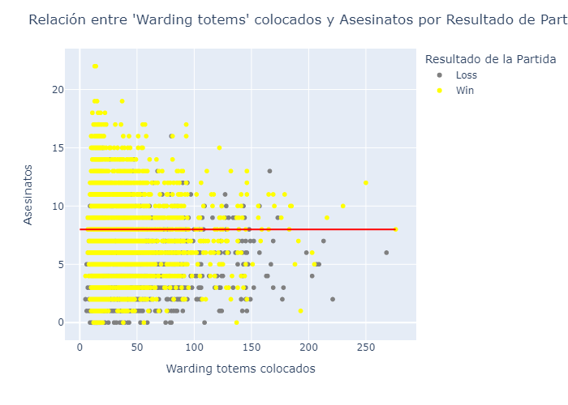
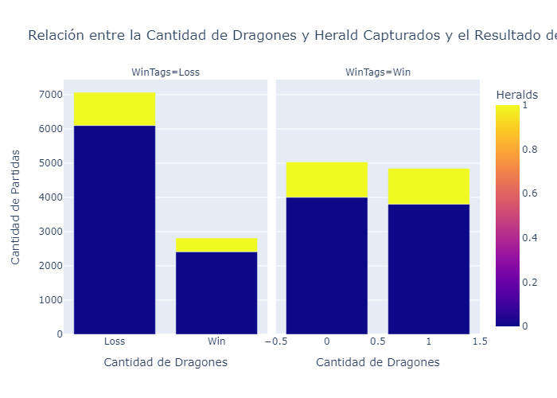
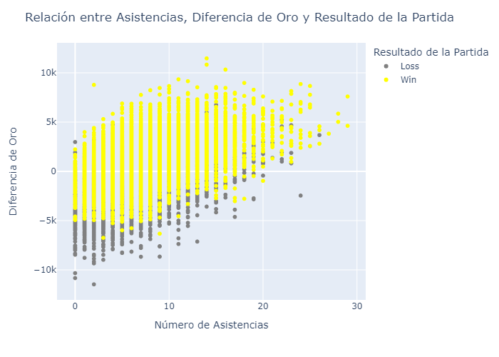
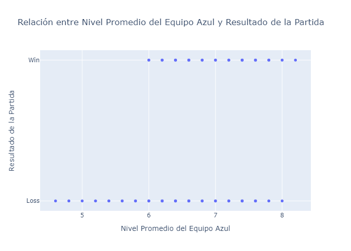
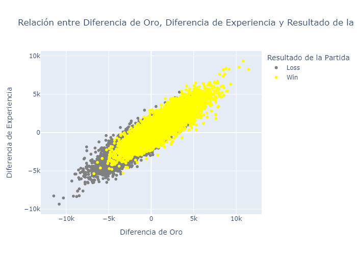

# ML para el Éxito en el Mundo de League of Legends

## Índice
   1. ¿Qué es League of Legends?
   2. Objetivos del análisis
   3. Fuente de datos
   4. Implicaciones de los hallazgos
   5. Resumen de los resultados

## ¿Qué es League of Legends? 
Antes de adentrarnos en nuestra propuesta, permítanme    ofrecerles un contexto sobre League of Legends. Este videojuego, desarrollado por Riot Games, ha revolucionado el mundo de los deportes electrónicos. League of Legends es un juego en línea de estrategia y acción, que reúne a jugadores de todo el mundo en partidas competitivas. Con millones de jugadores y espectadores, League of Legends se ha convertido en un fenómeno global.

El juego se basa en la estrategia y la coordinación en equipo, ya que cada campeón tiene roles y habilidades específicas que deben utilizarse de manera efectiva. Los jugadores ganan oro y experiencia a lo largo de la partida, lo que les permite mejorar sus campeones y comprar objetos para fortalecer sus habilidades.

Sin duda, la liga de League of Legends ha experimentado un notable crecimiento en los últimos años. Para dar una idea más precisa, veamos algunos datos concretos. En 2010, el juego tenía aproximadamente 5 millones de usuarios, y hoy en día, en 2021, ese número ha superado los 155 millones. Esto representa un crecimiento impresionante, con un incremento de más del 3100% en la base de usuarios en tan solo una década. Este crecimiento vertiginoso no se limita solo a la comunidad de jugadores, ya que los espectadores también han aumentado sustancialmente.

Los torneos de alto nivel, como el Campeonato Mundial de League of Legends, han sido testigos de un incremento constante en la audiencia. En 2010, apenas 1 millón de usuarios se conectaban diariamente para participar en partidas, y en 2021, esta cifra ha superado los 31 millones. Esto equivale a un aumento de más del 3000% en la cantidad de usuarios conectados diariamente durante este período. La creciente base de jugadores y espectadores ha convertido a League of Legends en un fenómeno global, atrayendo a fanáticos de todas partes del mundo.

### Crecimiento de Usuarios de League of Legends
Además , a medida que la escena competitiva ha crecido, también se ha vuelto más profesional. Grandes organizaciones y patrocinadores respaldan a equipos y jugadores, lo que demuestra la inversión y el compromiso que el juego ha generado en la industria de los deportes electrónicos. Este emocionante crecimiento y la perspectiva de seguir atrayendo a nuevos jugadores y fanáticos hacen de League of Legends un mercado prometedor y dinámico para cualquier inversor en busca de oportunidades en los deportes electrónicos

El crecimiento fenomenal de League of Legends no solo se ha manifestado en números, sino también en la dedicación apasionada de su comunidad de jugadores. Como hemos observado, millones de usuarios se conectan diariamente, y esta base activa de jugadores ha demostrado un compromiso inquebrantable con el juego. Participan activamente en foros de discusión, utilizan redes sociales para compartir estrategias y experiencias, y se sumergen en plataformas de transmisión en vivo para aprender y entretenerse. Además, la formación de clanes y equipos amateur ha impulsado la competencia a niveles locales y regionales, creando una vibrante escena competitiva en todo el mundo. Esta comunidad apasionada y comprometida es un testimonio de la influencia duradera de League of Legends en el mundo de los deportes electrónicos.

---

### Objetivos del análisis:
El presente informe tiene como objetivo analizar un conjunto de datos de partidas clasificatorias Diamante de League of Legends (LoL) en los primeros 10 minutos, con el propósito de proporcionar información valiosa para un nuevo equipo que busca optimizar su rendimiento y estrategias. El dataset contiene estadísticas de aproximadamente 10,000 partidas con jugadores de niveles similares. El valor objetivo a predecir es si el equipo azul ganó la partida (valor 1) o no (valor 0).

Referncias:
- https://www.redbull.com/ar-es/lol-el-sistema-de-ranking-de-league-of-legends-explicado
- https://tips.gg/es/lol/teams/

---

### Insight encontrados [Code](notebook/002_Insight.ipynb)

- **Control temprano del mapa**: El hecho de que equipos que colocan más "Warding totems", obtienen más asesinatos y torres tengan una mayor probabilidad de victoria resalta la importancia de la visión del mapa y las estrategias de emboscada para obtener ventajas iniciales.

- **Importancia de los objetivos neutrales**: La correlación entre asegurar más dragones y Herald en los primeros 10 minutos y una mayor tasa de victoria enfatiza la necesidad de coordinar y priorizar la captura de objetivos neutrales para obtener beneficios significativos para todo el equipo.

- **Desempeño individual y ventaja económica**: El número de asistencias y las diferencias de oro y experiencia entre los equipos como indicadores cruciales de la probabilidad de victoria destacan la importancia del desempeño individual y la ventaja económica para el éxito del equipo.

- **Nivel promedio del equipo**: La correlación entre un mayor nivel promedio del equipo azul y una mayor probabilidad de ganar subraya la importancia de mantener un ritmo de crecimiento constante y eficiente durante la fase temprana del juego.ntener un ritmo de crecimiento constante y eficiente durante la fase temprana del juego.

- **Diferencias de oro y experiencia determinantes**: La fuerte vinculación entre las diferencias de oro y experiencia entre los equipos en los primeros 10 minutos y los resultados resalta la relevancia de obtener una ventaja significativa en estos aspectos.

---

### Hipotesis
Estas hipótesis proporcionan una base sólida para realizar pruebas y análisis más detallados sobre el dataset de League of Legends. Al evaluar cada una de estas hipótesis y validarlas con datos, el equipo podrá obtener una mejor comprensión de los factores que realmente influyen en el rendimiento y la probabilidad de victoria en el juego.

- **Hipótesis 1**: Control temprano del mapa y victoria
Equipos que logran un mayor control del mapa mediante la colocación de más "Warding totems" en áreas estratégicas durante los primeros 10 minutos tendrán una mayor probabilidad de ganar la partida.

- **Hipótesis 2**: Relación entre asesinatos y tasa de victoria
El número de asesinatos conseguidos por un equipo en los primeros 10 minutos se correlacionará positivamente con su tasa de victoria. Cuanto mayor sea la cantidad de asesinatos, más alta será la probabilidad de ganar.

- **Hipótesis 3**: Impacto de objetivos neutrales en la victoria
Equipos que aseguran más dragones y Herald durante los primeros 10 minutos tendrán una mayor probabilidad de ganar la partida, ya que estos objetivos proporcionan beneficios significativos para todo el equipo.

- **Hipótesis 4**: Importancia de la ventaja económica y de experiencia
Equipos que logran una ventaja significativa en oro y experiencia sobre el equipo contrario en los primeros 10 minutos tendrán mayores posibilidades de obtener la victoria.

- **Hipótesis 5**: Contribución individual y tasa de victoria
Jugadores que contribuyen con un mayor número de asistencias tendrán un impacto positivo en la tasa de victoria de su equipo en las partidas clasificatorias Diamante.

- **Hipótesis 6**: Roles clave para el éxito
Identificar roles específicos, como un jungla efectivo o un carry con muchas asistencias, será crucial para el éxito del equipo y aumentará sus posibilidades de ganar.

- **Hipótesis 7**: Nivel promedio y probabilidad de victoria
Un equipo con un mayor nivel promedio de sus jugadores durante los primeros 10 minutos tendrá una mayor probabilidad de ganar la partida.

- **Hipótesis 8**: Adaptabilidad y éxito
Equipos que pueden ajustar sus tácticas y estrategias según la situación en los primeros 10 minutos tendrán una mayor probabilidad de lograr la victoria en partidas clasificatorias Diamante.