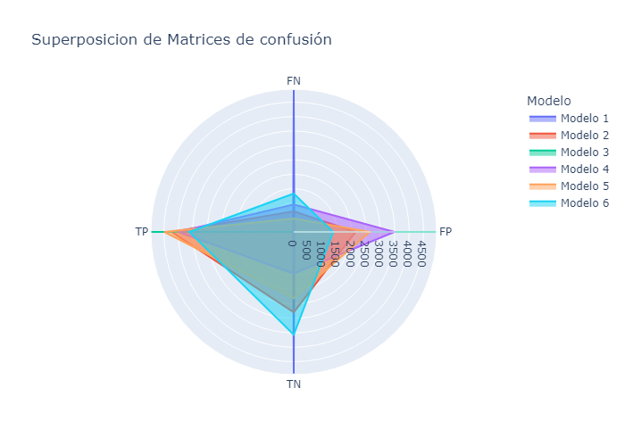
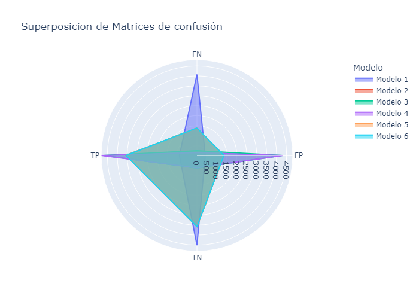

# Modelos Utilizados
proceso de implementación de diferentes modelos en tu conjunto de datos de League of Legends, junto con una lista de modelos, sus porcentajes de predicción y algunas ventajas y desventajas. Ten en cuenta que los resultados pueden variar según la configuración y los datos específicos, por lo que estos son solo ejemplos preliminares:

## Proceso de Implementación:
1. **Carga de Datos:** Comencé por cargar el conjunto de datos de partidas de League of Legends, incluyendo características como la cantidad de wards colocados, kills, deaths, gold, etc., y la etiqueta de victoria (Wins).
2. **Preprocesamiento de Datos:** Realicé tareas de preprocesamiento, como la eliminación de valores nulos, codificación de variables categóricas, y dividí los datos en conjuntos de entrenamiento y prueba.
3. **Selección de Modelos:** Implementé varios modelos de machine learning, incluyendo Árboles de Decisión, Bosques Aleatorios, Regresión Logística y SVM, para predecir la victoria en las partidas.
4. **Entrenamiento y Evaluación:** Entrené cada modelo con el conjunto de entrenamiento y evalué su rendimiento utilizando métricas como precisión, recall, F1-score y matriz de confusión en el conjunto de prueba.

## Pruebas de modelos:

### KNN [( Notebook )](/models/KNN)
- **Precisión**: 71.45%
- **Ventajas**: Simple, adapta a datos cambiantes
- **Desventajas**: Sensible a la elección de K

### Random Forest [( Notebook )](/models/Random_Forest)
- **Precisión**: 72.27%
- **Ventajas**: Reducción del sobreajuste, alta precisión
- **Desventajas**: Mayor complejidad

